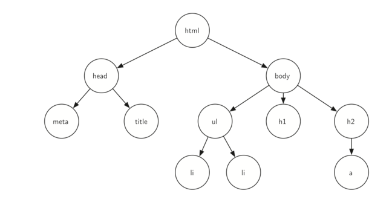

# Binary-tree

<p>Trees are a special kind of graph that represents a hierarchy of things, like employee-boss relationships in a corporate hierarchy, or folders on a drive, where each folder can have other files and folders inside of it. </p>
	
<p> Main uses of trees include maintaining hierarchical data, providing moderate access and insert/delete operations. Binary trees are special cases of tree where every node has at most two children.</p>

> The major advantage of binary search trees over other data structures is that the related sorting algorithms and search algorithms such as in-order traversal can be very efficient; they are also easy to code. 


<p>A Binary Tree node contains following parts.</p>
* Data
* Pointer to left child
* Pointer to right child


Binary tree has following properties:
- Height — The height of a node is the maximum number of edges separating that node from a leaf (see leaf).
- Depth — The depth of a node is the number of edges separating that node from the root node.
- Size — The size of a tree is the number of nodes it contains.
- Balance — The balance factor of a node is the difference between the height of its left subtree and the height of its right subtree.
- Leaf — A leaf is a node that doesn’t have any children, in other words, an end node.

```
# A class that represents an individual node in a 
# Binary Tree 
class Node: 
	def __init__(self,key): 
		self.left = None
		self.right = None
		self.val = key 


# create root 
root = Node(1) 
''' following is the tree after above statement 
		1 
	/ \ 
	None None'''

root.left	 = Node(2); 
root.right	 = Node(3); 
	
''' 2 and 3 become left and right children of 1 
		1 
		/ \ 
		2	 3 
	/ \ / \ 
None None None None'''


root.left.left = Node(4); 
'''4 becomes left child of 2 
		1 
	/	 \ 
	2		 3 
	/ \	 / \ 
4 None None None 
/ \ 
None None'''
```

## Probles you can solve with tree structure 
For example, the following three questions can all be modeled and answered using the same or similar algorithms on trees:

- If I have a map of possible flights, how can I get from city A to city B in the least number of flights / in the shortest time?
- If I have two people on LinkedIn or Facebook, what's the shortest chain of introductions that would connect these people?
- Given a map of roads, how can I get from point A to point B in the shortest distance / time?


## Example of Trees 





Figure 3: A Tree Corresponding to the Markup Elements of a Web Page

The HTML source code and the tree accompanying the source illustrate another hierarchy. Notice that each level of the tree corresponds to a level of nesting inside the HTML tags. The first tag in the source is <html> and the last is </html> All the rest of the tags in the page are inside the pair. If you check, you will see that this nesting property is true at all levels of the tree.